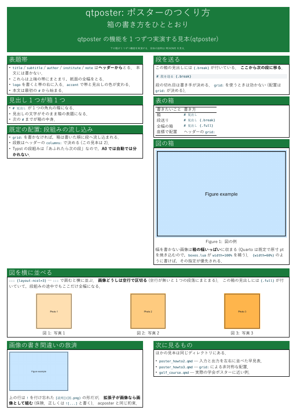
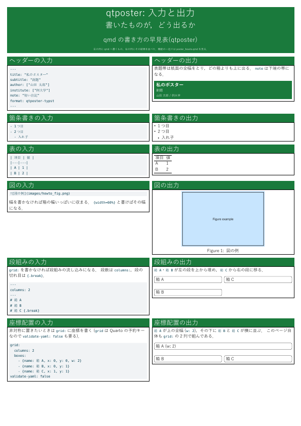
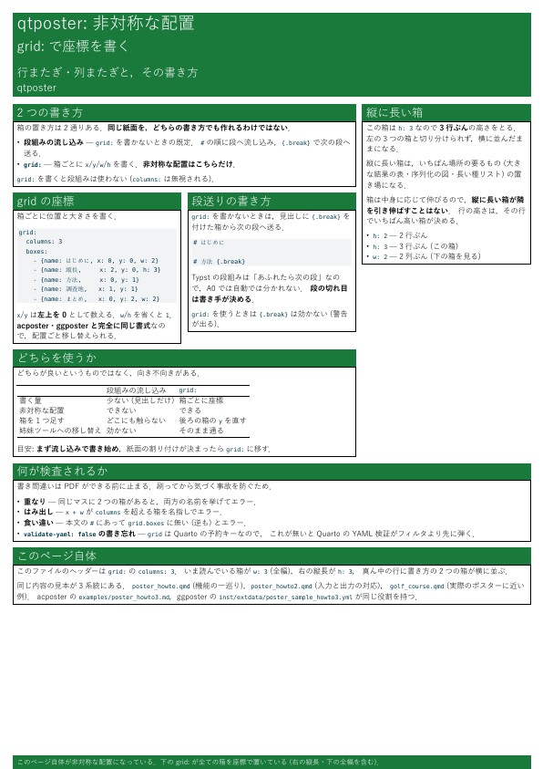
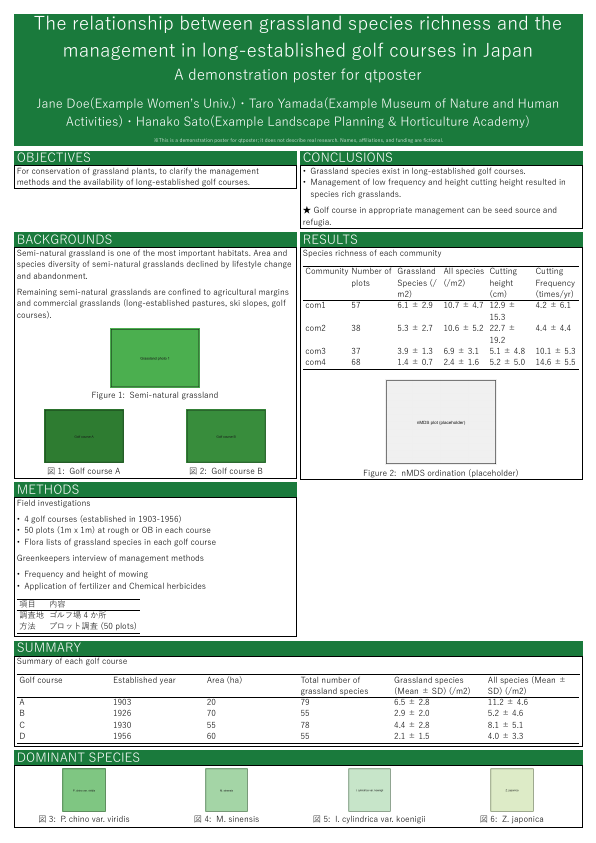

# qtposter

qmd 原稿から学会用のポスター (A0) を作るための最小の Quarto 拡張．
**Quarto + Typst** で組む．組版は
[peace-of-posters](https://github.com/jonaspleyer/peace-of-posters) (MIT) に任せ，
qtposter は **Markdown の書き方を決める薄い層**だけを持つ．

ポスターを作るツールは3系統ある
([ggposter](https://github.com/matutosi/ggposter)・
[acposter](https://github.com/matutosi/acposter)・qtposter)．
**互いに置き換えるものではなく，案件ごとに選ぶ**．
README の項目と順序は3つで揃えてある．

## つくれるもの

- 用紙: A0 (既定)．`paper:` で A1〜A4 にもできる (**縦のみ．向きは変えられない**)
- `# 見出し` ごとに1つの箱 (peace-of-posters の `column-box`)
- 既定は段組みの流し込み．段の切れ目は `# 見出し {.break}`，全幅の箱は `# 見出し {.full}`
- ヘッダーに `grid:` (各箱の `x`/`y`/`w`/`h` 座標) を書けば非対称な配置にできる
- 図 (高さの上限つき)・表 (booktabs 調)・箇条書き・コードチャンク (`{r}` を書けば実行して図も出せる)
- 副題・ロゴ・差し色
- **日本語の禁則処理と数式は Typst の質がそのまま出る**

## 前提

- **Quarto 1.5 以降**．2026-08-31 に確認した動作環境は **1.10.18 / Typst 0.15.1**．
  組版に使う peace-of-posters 0.6.0 も `grid.cell` も **Typst 0.11 以降**の機能なので，
  **Quarto 1.4 (Typst 0.10) では組めない**．
- Typst と peace-of-posters は Quarto が自動で取ってくる (手で入れるものは無い)．
- 和文フォント (既定は `Yu Gothic`．`font:` で変えられる)．

## 使い方

```powershell
quarto render poster.qmd
```

ヘッダーで用紙・段数・書体などを決める．

```yaml
title: "半自然草原の植生と管理"
subtitle: "管理の頻度と種組成"   # 省略可
author: ["松村 俊和"]
institute: "所属機関名"
paper: "a0"      # 用紙 (a0〜a4．版面の文字寸法も用紙に合わせて変わる)
columns: 3       # 段数
font: "Yu Gothic"
font-size: 32pt  # 省略すると用紙に合った既定 (a0 なら 33pt)
note: "植生学会第30回大会"   # 表題帯の下端に小さく入る
logo: images/logo.png    # 省略可．表題帯の右に入る
accent: "#1a7a3c"        # 省略可．見出し帯の色 (既定は uni-fr の紺)
format: qtposter-typst
```

組んだあとは**検算**する．刷ってから気づく事故を防ぐため，
ページ数 (ポスターは常に1)・用紙実寸・埋め込みフォントを見る
(出力の文言は acposter と揃えてある)．

```powershell
pwsh -File check_poster_pdf.ps1              # 直下の PDF を全部見る
pwsh -File check_poster_pdf.ps1 -Pdf poster.pdf
pwsh -File check_poster_pdf.ps1 -Pdf poster.pdf,golf_course.pdf   # 組んだものだけ見る
pwsh -File check_poster_pdf.ps1 -Pdf poster.pdf -Paper a1
```

**問題が1つでもあれば終了コード 1 で終わる**ので，そのまま CI に置ける．
組んだ直後に確かめるときは，**組んだ PDF を並べて渡す** (引数を省くと直下の PDF を
全部見るので，古い PDF まで数に入る)．

中間の Typst を見たいときは `_extensions/qtposter/_extension.yml` に
`keep-typ: true` を足す (acposter の `-KeepHtml` にあたる)．

## 書き方の約束

- **`# 見出し` が1つの箱**になる (acposter と同じ約束)．
  **見出しの中でも Markdown が使える** (`# *Rubus* の分布` の強調は Typst へそのまま渡る)．
  **同じ見出し名を2回書くとエラーで止まる** (箱は名前で引くため)．
- **`# 見出し {.break}` と書くと，その箱から次の段へ送る**．
  Typst の `columns` は「あふれたら次の段」なので，**A0 では自動で分かれない**．
  段の切れ目は書き手が決める．
- **`# 見出し {.full}` と書くと，その箱だけ全幅**になる．段組みをいったん閉じ，
  箱のあとで開き直す．幅の広い表や，最後の「まとめ」に使う
  (`grid:` を使うときは効かない．`w:` で同じことができる)．
- **画像の幅は既定で段幅いっぱい**になる．`{width=60%}` と書けば
  その指定が優先される．
- **画像の高さには上限がある**．既定は**その箱に使える高さの 25%**で，
  超える画像は縦横の比を保ったまま縮む (縦長の画像1枚で箱が伸びきり，
  後ろの箱が紙面から溢れるのを防ぐ)．ヘッダーの `fig-max-height: 30%` で変えられる．
- **表は booktabs 調**になる (上端・見出しの下・下端の3本だけ．縦罫は引かない)．
- 画像を横に並べたいときは `::: {layout-ncol=2}` … `:::` で囲む
  (**画像どうしは空行で区切る**)．
- **`!` の付け忘れは救済する**．`[説明](図.png)` のように書いても，拡張子が画像なら
  画像として組む (正しくは `![...]`)．acposter と同じ約束．
- **和文の行末の改行は詰める**．1文1行で書いてよい．
  空白が残るのは**欧文どうしの境目だけ** (`plants,` と `to clarify` は離れたまま)．
  acposter・`build-abstract-pdf`・`build-slide-pdf` と同じ判定．
- 表・箇条書き・コードブロックはふつうの Markdown．

## 配置の決め方

書かなければ**段組みの流し込み** (段数は `columns:`，切れ目は `{.break}`)．
**箱の位置を座標で決めたい**ときは `grid:` を書く．
**acposter・ggposter とまったく同じ書式**なので，配置ごと移し替えられる．

```yaml
grid:
  columns: 3
  boxes:
    - {name: はじめに, x: 0, y: 0, w: 2}   # 左2列ぶんの幅
    - {name: 結果一覧, x: 2, y: 0, h: 3}   # 右列で3行ぶんの高さ
    - {name: 方法,     x: 0, y: 1}
    - {name: 調査地,   x: 1, y: 1}
    - {name: まとめ,   x: 0, y: 2, w: 2}
validate-yaml: false
```

- `x`・`y` は **0 から数える**．`w`・`h` を省くと 1．
- **`validate-yaml: false` が要る**．`grid` は **Quarto 自身が予約しているキー**
  なので，これを付けないと Quarto の YAML 検証がフィルタより先に弾く．
  **キー名を変えると3つのツールで揃わなくなる**ので，検証を切るほうを採った．
- 重なり・右へのはみ出し・本文の見出しとの食い違いは**名指しでエラーにして止める**．
- `{.break}`・`{.full}` は `grid:` を使うときは効かない (配置は `grid:` が決める)．警告が出る．
- `x`・`y`・`w`・`h`・`columns` は**整数で書く**．小数や数値でない値は**エラーで止まる**
  (黙って既定値に落とすと，書き間違いに気づけないまま別の場所へ置かれる)．
- **仕組み**: 座標をそのまま Typst の `grid.cell(x:, y:, colspan:, rowspan:)` に
  渡すだけなので，**組めない配置は無い**．2026-08-31 まではギロチン分割
  (箱をまたがない切れ目で再帰的に割る) で代用しており，縦にも横にも切れ目が無い
  配置は組めなかった．Quarto 1.10 (Typst 0.15) へ上げてこの制限は無くなった．

## 見本

| | 見本 | 内容 |
|---|---|---|
| 1 | [`poster_howto.qmd`](poster_howto.qmd) | 機能の一巡り (箱・`{.break}`・`{.full}`・表・図・図の横並び・画像の救済) |
| 2 | [`poster_howto2.qmd`](poster_howto2.qmd) | 入力と出力の早見表．左の列に qmd へ書くもの，右の列にその結果 |
| 3 | [`poster_howto3.qmd`](poster_howto3.qmd) | 非対称な配置．`grid:` の座標指定と，段組みとの使い分け |
| 4 | [`golf_course.qmd`](golf_course.qmd) | 実際のポスターに近い例 (架空のデータ)．`grid:` で非対称に置く |

```powershell
quarto render poster_howto.qmd
```

縮小した見本 (画像をクリックすると原稿の qmd へ)．

| 1. 機能の一巡り | 2. 入力と出力の早見表 |
|---|---|
| [](poster_howto.qmd) | [](poster_howto2.qmd) |

| 3. 非対称な配置 | 4. 実際のポスターに近い例 |
|---|---|
| [](poster_howto3.qmd) | [](golf_course.qmd) |

このほかに最小の見本 [`poster.qmd`](poster.qmd) (段組みの流し込み) がある．

## 姉妹ツールとの行き来

**本文の書き方は統一できない** (構造化データと散文という根の違い)．
そのかわり**ヘッダーと配置は移し替えられる**．

| 意味 | 正 | 受ける別名 |
|---|---|---|
| 副題 | `subtitle` | (無し) |
| 著者 | `author` | `authors`・`poster-authors` |
| 所属 | `institute` | `institutes`・`affiliation`・`affiliations` |
| 注記 | `note` | `funding`・`footer` |
| 用紙 | `paper` | (無し)．`a0`〜`a4` |
| 段数 | `columns` | `cols` |
| 文字サイズ | `font-size` | `font_size`・`size` |
| 書体 | `font` | (無し) |
| ロゴ | `logo` | (無し) |
| 差し色 | `accent` | (無し) |

- **`size` を正にしない**のは，ggposter が `size` を**用紙**の意味で使っているため．
  qtposter が元から使っていた `size` (文字サイズ) は別名として引き続き通る．
- **`orientation` は受けない**．peace-of-posters の版面が縦で固定なうえ，
  Quarto 自身が予約していて (値は `rows`/`columns`)，`landscape` と書くと
  Quarto の YAML 検証がフィルタより先に弾く．
- **`columns` は Quarto 自身も使う**ので，フィルタが読み替えたあと消している
  (残すと `#set page(columns:)` が出て段組みが二重になる)．
- 3つの比較は `todo/.claude/notes/poster_tools.md`．

## 構成

| ファイル・ディレクトリ | 中身 |
|---|---|
| `_extensions/qtposter/_extension.yml` | 形式の定義 |
| `_extensions/qtposter/typst-template.typ` | peace-of-posters を呼ぶ関数 (`qtposter`) |
| `_extensions/qtposter/typst-show.typ` | YAML を関数の引数へ渡す |
| `_extensions/qtposter/boxes.lua` | `# 見出し` → 箱，`{.break}` → 段送り，`grid:` → `grid.cell`，画像の幅の既定値，ヘッダーのキー名の別名 |
| `poster.qmd` | 最小の見本 (段組みの流し込み) |
| `poster_howto.qmd`・`poster_howto2.qmd`・`poster_howto3.qmd`・`golf_course.qmd` | 見本4本と，その PDF |
| `check_poster_pdf.ps1` | できた PDF の検算 (ページ数・用紙実寸・埋め込みフォント) |
| `tests/run_lua_tests.ps1` | `boxes.lua` の単体テスト (**pandoc だけで走る**) |
| `tests/meta_probe.tpl` | テストがヘッダーの値を見るための小さな pandoc テンプレート |
| `images/` | 見本が使う仮の画像 |
| `previews/` | README に載せる見本の縮小画像 (PDF から `pdftoppm -r 18` で作る) |
| `notes/` | 調査の記録 (Quarto + Typst のポスター作例・試作で踏んだ罠) |
| `.github/workflows/test.yml` | CI (単体テスト → Ubuntu・macOS で見本5本を組み，中身と検算まで確かめる) |
| `LICENSE` | MIT |

## テスト

`boxes.lua` の単体テストは **pandoc だけで走る** (Quarto も Typst も Chrome も要らない)．
小さな md を通して，出てきた Typst と，エラー・警告の文面を確かめる．
見るのは「組めるか」ではなく「**書き間違いを黙って通さないか**」．

```powershell
pwsh -File tests/run_lua_tests.ps1
```

CI は**この単体テストが通ってから**，Ubuntu と macOS で見本5本を組み，
`pdftotext` で中身を確かめ，`check_poster_pdf.ps1` で検算する
(**和文は `pdftotext` で抜き出せない**ので，目印には欧文を使う)．

## 現状と経緯

- **2026-08-30 に着手した最小の試作**．出発点に peace-of-posters を選んだ経緯は
  [`notes/survey_quarto_typst.md`](notes/survey_quarto_typst.md)．
- 詳しい進捗は [`.claude/CLAUDE.md`](.claude/CLAUDE.md)．

## ライセンス

**MIT** ([`LICENSE`](LICENSE))．
組版に使う [peace-of-posters](https://github.com/jonaspleyer/peace-of-posters) も MIT
(同梱はせず，Quarto が取ってくる)．
