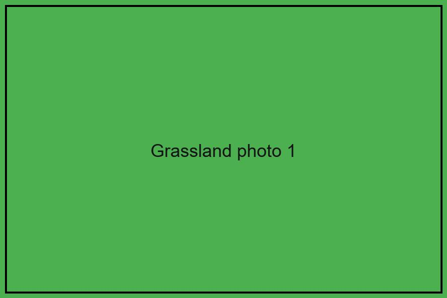
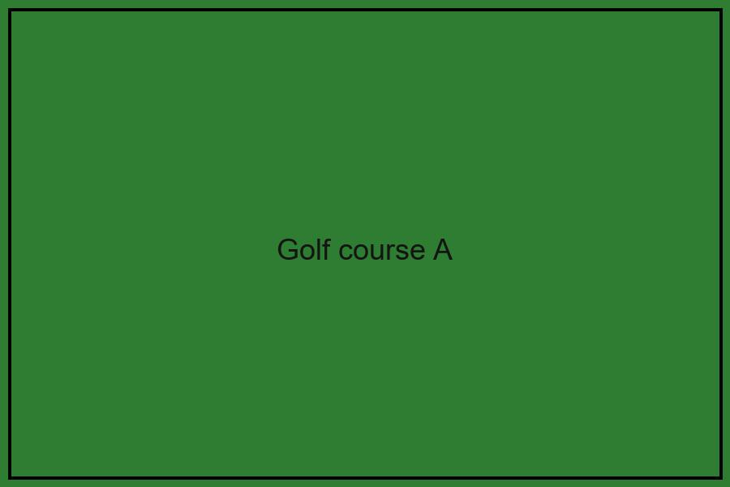
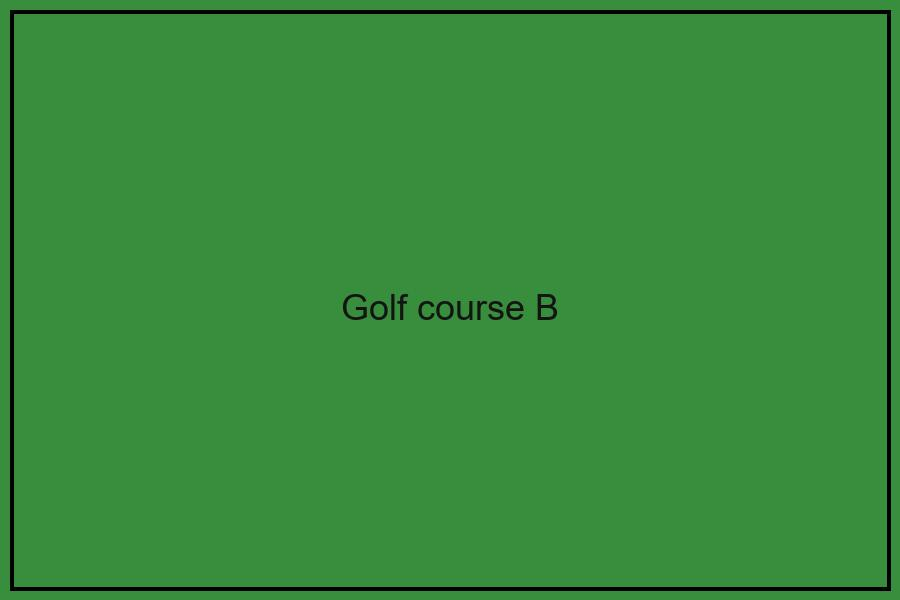
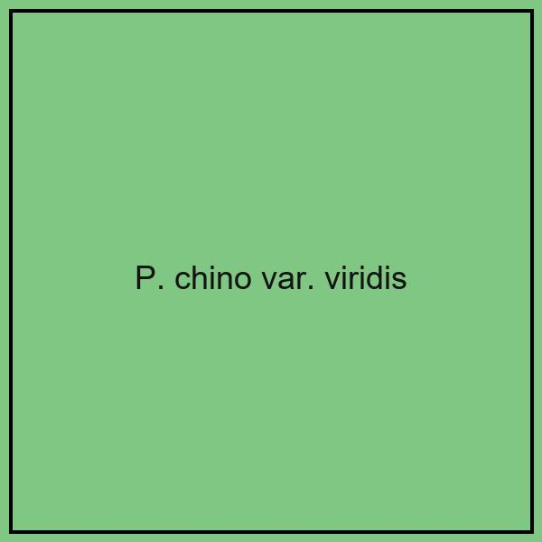
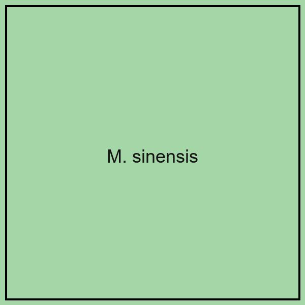
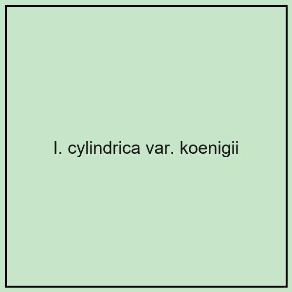
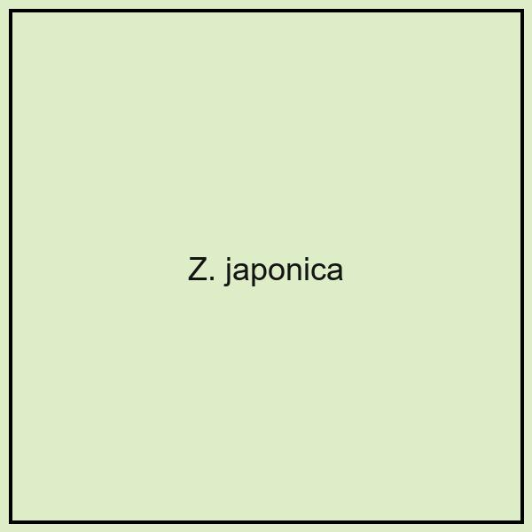

# OBJECTIVES

For conservation of grassland plants,
to clarify the management methods and the availability of
long-established golf courses.

# CONCLUSIONS

- Grassland species exist in long-established golf courses.
- Management of low frequency and height cutting height resulted in species rich grasslands.

★ Golf course in appropriate management can be seed source and refugia.

# BACKGROUNDS

Semi-natural grassland is one of the most important habitats.
Area and species diversity of semi-natural grasslands declined
by lifestyle change and abandonment.

Remaining semi-natural grasslands are confined to
agricultural margins and commercial grasslands
(long-established pastures, ski slopes, golf courses).

{width=32%}

::: {layout-ncol=2}
{width=60%}

{width=60%}
:::

# METHODS

Field investigations

- 4 golf courses (established in 1903-1956)
- 50 plots (1m x 1m) at rough or OB in each course
- Flora lists of grassland species in each golf course

Greenkeepers interview of management methods

- Frequency and height of mowing
- Application of fertilizer and Chemical herbicides

| 項目 | 内容 |
| --- | --- |
| 調査地 | ゴルフ場4か所 |
| 方法 | プロット調査 (50 plots) |

# RESULTS

Species richness of each community

| Community | Number of plots | Grassland Species (/m2) | All species (/m2) | Cutting height (cm) | Cutting Frequency (times/yr) |
| --- | --- | --- | --- | --- | --- |
| com1 | 57 | 6.1 ± 2.9 | 10.7 ± 4.7 | 12.9 ± 15.3 | 4.2 ± 6.1 |
| com2 | 38 | 5.3 ± 2.7 | 10.6 ± 5.2 | 22.7 ± 19.2 | 4.4 ± 4.4 |
| com3 | 37 | 3.9 ± 1.3 | 6.9 ± 3.1 | 5.1 ± 4.8 | 10.1 ± 5.3 |
| com4 | 68 | 1.4 ± 0.7 | 2.4 ± 1.6 | 5.2 ± 5.0 | 14.6 ± 5.5 |

{width=40%}

# SUMMARY

Summary of each golf course

| Golf course | Established year | Area (ha) | Total number of grassland species | Grassland species (Mean ± SD) (/m2) | All species (Mean ± SD) (/m2) |
| --- | --- | --- | --- | --- | --- |
| A | 1903 | 20 | 79 | 6.5 ± 2.8 | 11.2 ± 4.6 |
| B | 1926 | 70 | 55 | 2.9 ± 2.0 | 5.2 ± 4.6 |
| C | 1930 | 55 | 78 | 4.4 ± 2.8 | 8.1 ± 5.1 |
| D | 1956 | 60 | 55 | 2.1 ± 1.5 | 4.0 ± 3.3 |

# DOMINANT SPECIES

::: {layout-ncol=4}
{width=40%}

{width=40%}

{width=40%}

{width=40%}
:::
