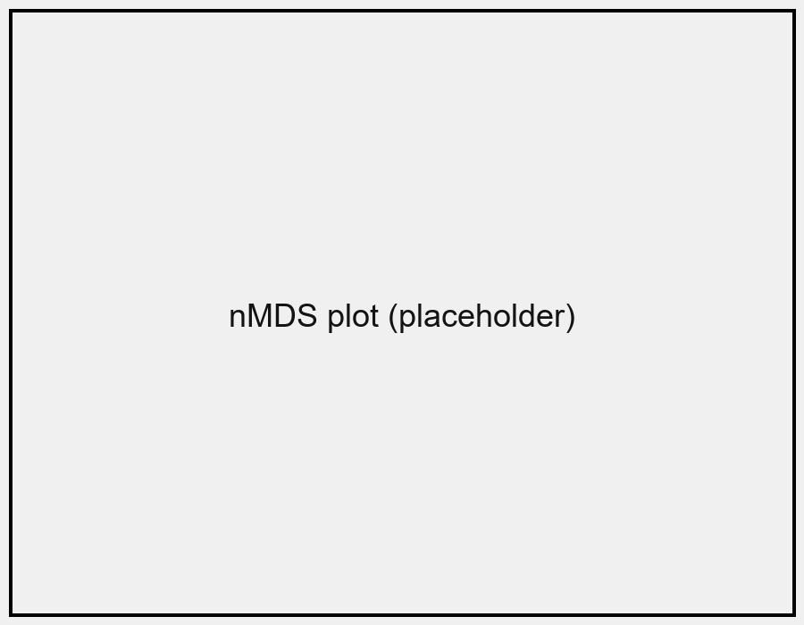

# はじめに

半自然草原は，人の管理によって維持されてきた生態系である．
管理の停止にともなって面積が減り，草原生植物の生育地が失われている．

本ポスターは **Quarto + Typst** で組んだ試作である．
日本語の禁則処理 (「括弧」や，句読点) が正しく効くかを確かめる．

# 方法

- 調査地: 兵庫県内の6地点
- 方形区: 1 m × 1 m を各地点20個
- 記録: 出現種と被度

| 項目 | 値 |
|---|---|
| 地点数 | 6 |
| 方形区数 | 120 |
| 出現種数 | 245 |

# 結果 {.break}

管理の頻度が高い地点ほど，草原生植物の種数が多い傾向がみられた．

# 考察

年1回以上の刈り取りが，草原生植物の維持に寄与すると考えられる．

# まとめ {.break}

- 管理の頻度が種組成を強く規定する
- 刈り取りの停止は草原生植物の減少をまねく
