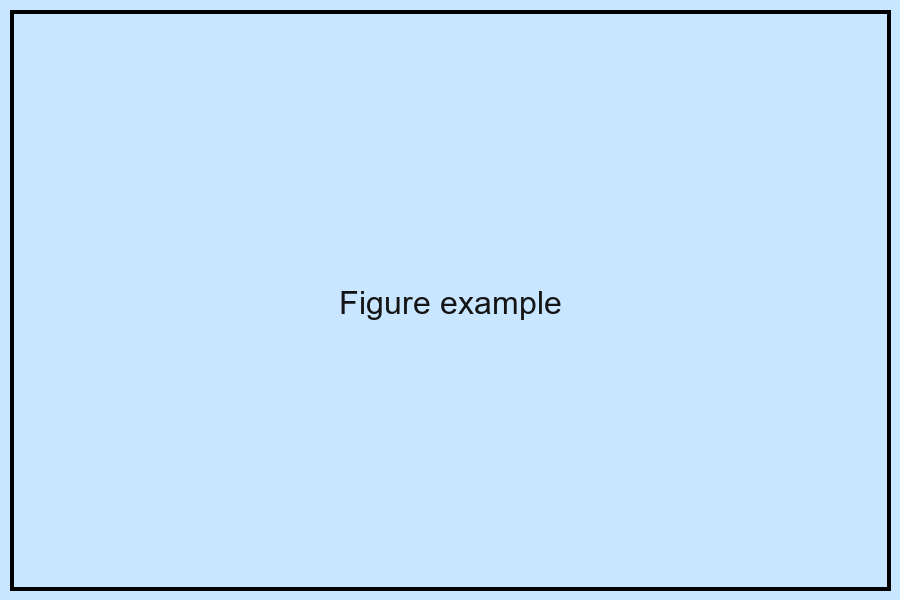
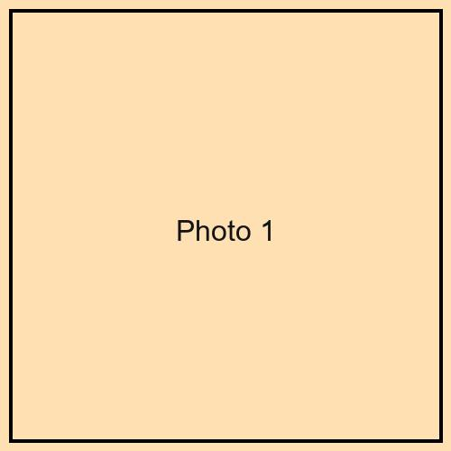
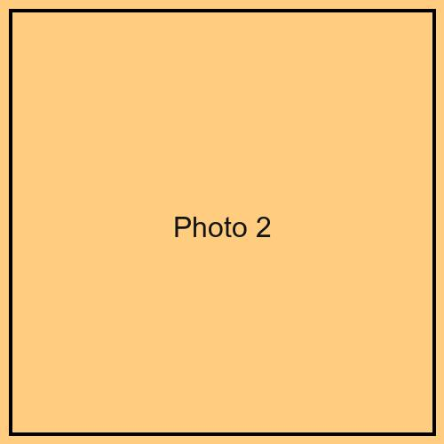

# 表題帯

- `title` / `subtitle` / `author` / `institute` / `note` は**ヘッダーから**とる．
  本文には書かない．
- これらは上端の帯にまとまり，紙面の全幅をとる．
- `logo` を書くと帯の右に入る．`accent` で帯と見出しの色が変わる．
- 本文は最初の `# ` から始まる．

# 見出し1つが箱1つ

- `# 見出し` が1つの角丸の箱になる．
- 見出しの文字がそのまま箱の表題になる．
- 次の `# ` までが箱の中身．

# 既定の配置: 段組みの流し込み

- `grid:` を書かなければ，箱は書いた順に段へ流し込まれる．
- 段数はヘッダーの `columns:` で決める (この見本は 3)．
- Typst の段組みは「あふれたら次の段」なので，**A0 では自動では分かれない**．

# 段を送る {.break}

この箱の見出しには `{.break}` が付いている．
**ここから次の段に移る**．

```
# 段を送る {.break}
```

段の切れ目は書き手が決める．
`grid:` を使うときは効かない (配置は `grid:` が決める)．

# 表の箱

| 書きたいこと | 書き方 |
| --- | --- |
| 箱 | `# 見出し` |
| 段送り | `# 見出し {.break}` |
| 座標で配置 | ヘッダーの `grid:` |
| 図の幅 | `{width=60%}` |

# 図の箱



幅を書かない画像は**箱の幅いっぱい**に収まる
(Quarto は既定で原寸 pt を焼き込むので，`boxes.lua` が `width=100%` を補う)．
`{width=60%}` のように書けば，その指定が優先される．

# 図を横に並べる

::: {layout-ncol=2}



:::

`::: {layout-ncol=2}` … `:::` で囲むと横に並ぶ．
**画像どうしは空行で区切る** (空行が無いと1つの段落にまとまる)．

# コードの箱

```r
# コードはそのまま組まれる
x <- rnorm(100)
mean(x)
```

チャンク (`` ```{r} ``) として書けば実行して図も出せる．
実行しないときは上のように言語名だけを書く．

# 姉妹ツールとの行き来

同じ種類のポスターを作るツールが3系統ある (ggposter・acposter・qtposter)．

- **ヘッダーのキー名は3つとも別名で受ける**
  (`author`/`authors`/`poster-authors` など)．
- **配置を移すときは `grid:`**．3つとも完全に同じ書式．
- 詳しくは `poster_howto3.qmd` と README を見る．

# 次に見るもの

- `poster_howto2.qmd` — 入力と出力を左右に並べた早見表．
- `poster_howto3.qmd` — `grid:` による非対称な配置．
- `golf_course.qmd` — 実際の学会ポスターに近い例．
